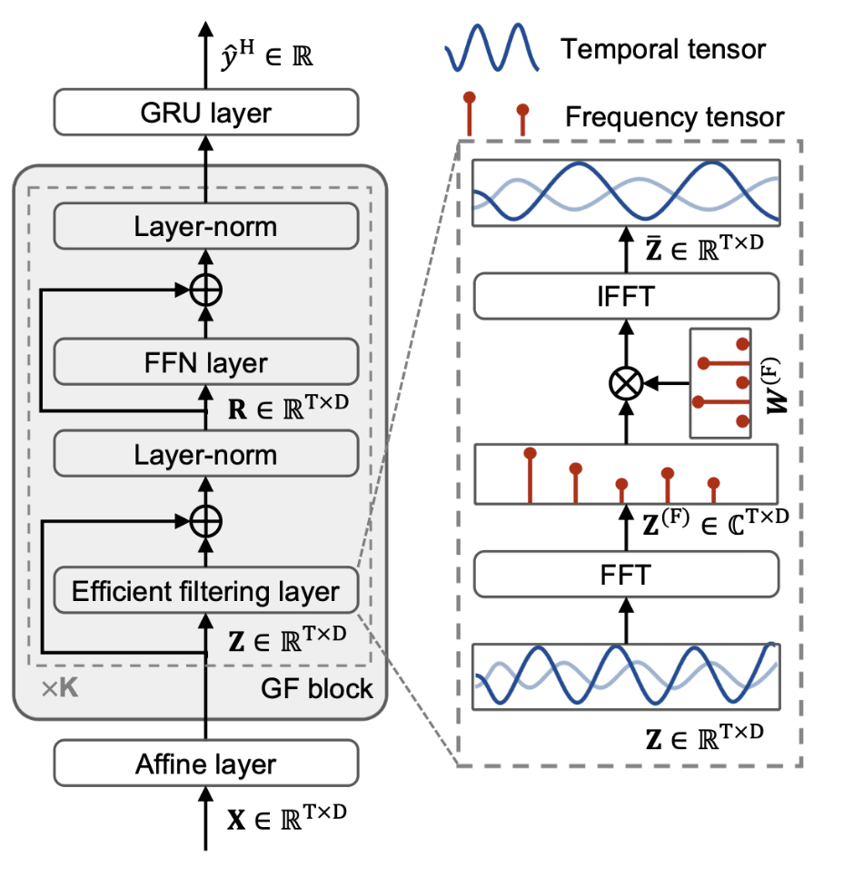

# DeepFilter: An Instrumental Baseline for Accurate and Efficient Process Monitoring

## Introduction

This repository contains the implementation of **DeepFilter**, a Transformer-style framework designed for process monitoring in Energy Conversion Plants (ECPs). DeepFilter addresses the limitations of canonical Transformers in ECP monitoring by introducing an efficient filtering layer that captures long-term and periodic patterns with reduced computational complexity. This model enhances both accuracy and efficiency, meeting the stringent demands of ECP monitoring.


**Abstract**:

> Effective process monitoring is increasingly vital for Energy Conversion Plants (ECPs) to ensure energy security and environmental safety, necessitating both high accuracy and efficiency. Although Transformers have demonstrated success in various fields, their canonical form is inadequate for ECP monitoring due to two primary limitations: (1) the self-attention mechanism captures step-wise correlations, neglecting discriminative long-term and periodic patterns in monitoring logs, thus compromising accuracy; (2) the quadratic computational complexity of attention mechanisms poses significant computation complexity and hampers efficiency. To address these issues, we propose DeepFilter, a Transformer-style framework for ECP monitoring. The core innovation is an efficient filtering layer that theoretically captures long-term and periodic patterns with reduced complexity. Equipping with the global filtering layer, DeepFilter enhances both accuracy and efficiency, meeting the stringent demands of ECP monitoring. Experimental results on real-world ECP monitoring datasets validate DeepFilter’s superiority in terms of accuracy and efficiency compared to existing state-of-the-art models.

## Requirements

- Python 3.6 or higher
- [PyTorch](https://pytorch.org/) 1.4.0 or higher
- NumPy
- scikit-learn
- pandas
- argparse
- logging

## Data Acquisition
The data will be daily updated in our website after double-blind peer review process. 

## Usage

The main script to run the DeepFilter model is `deepfilter.py`. You can configure various hyperparameters and settings through command-line arguments.


### Command-Line Arguments

- `--dataName`: Name of the dataset (default: `'0106A15'`)
- `--taskName`: Task type (`'S'` for single-step prediction, `'M'` for multi-step prediction) (default: `'S'`)
- `--rootPath`: Root directory for saving logs and models (default: `'baseline1226'`)
- `--modelName`: Name of the model (default: `'DeepFilter'`)
- `--trainProb`: Proportion of data used for training (default: `0.7`)
- `--validProb`: Proportion of data used for validation (default: `0.15`)
- `--hidR`: Number of RNN hidden units (default: `100`)
- `--layerR`: Number of RNN hidden layers (default: `1`)
- `--window`: Input window size (default: `16`)
- `--horizon`: Prediction horizon (default: `1`)
- `--epochs`: Number of training epochs (default: `200`)
- `--batchSize`: Training batch size (default: `64`)
- `--lr`: Learning rate (default: `0.001`)
- `--device`: GPU device ID (default: `0`)
- `--seed`: Random seed for reproducibility (default: `1024`)

For a complete list of arguments and their descriptions, run:

```bash
python main.py --help
```

### Example Usage

To train the model on a specific dataset with custom hyperparameters:

```bash
python main.py --dataName 'YourDatasetName' 
```

## Training and Evaluation

The training process involves:

- **Training**: The model is trained on the training set. Loss values are logged for each batch.
- **Validation**: After each epoch, the model is evaluated on the validation set. Early stopping is applied based on the validation R² score.
- **Testing**: Once training is complete, the model is evaluated on the test set.

Logs and model checkpoints are saved in the directory specified by `--rootPath`.

### Logs and Outputs

- Training loss per epoch: `trainLog.txt`
- Validation metrics per epoch: `validLog.txt`
- Test metrics after training: `testLog.txt`

These files are saved in the model's output directory, structured as:

```
./<rootPath>/<dataName>/<modelName><taskName><horizon>/<labda>/<seed>/
```

## Results

The DeepFilter model demonstrates superior performance in both accuracy and efficiency compared to existing state-of-the-art models, as validated on real-world ECP monitoring datasets.

*Note: Detailed results and analysis can be found in the paper or will be updated here when available.*

